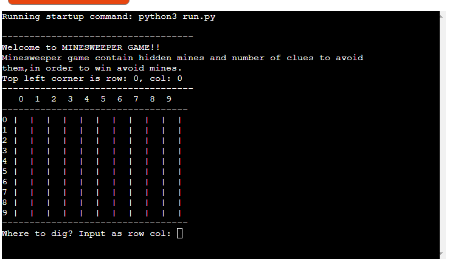
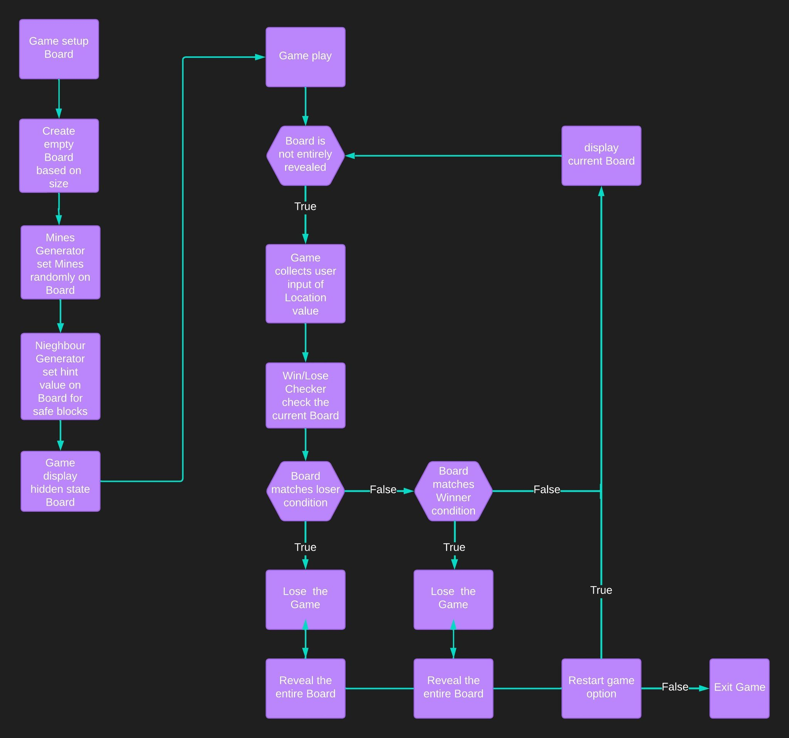
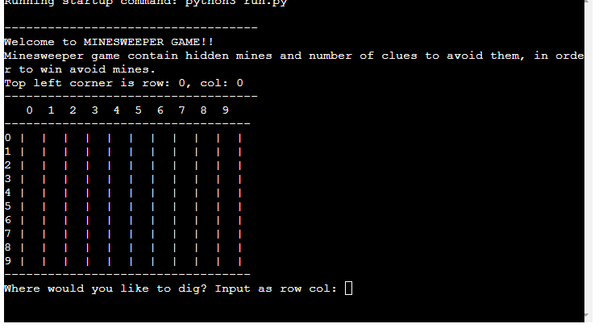
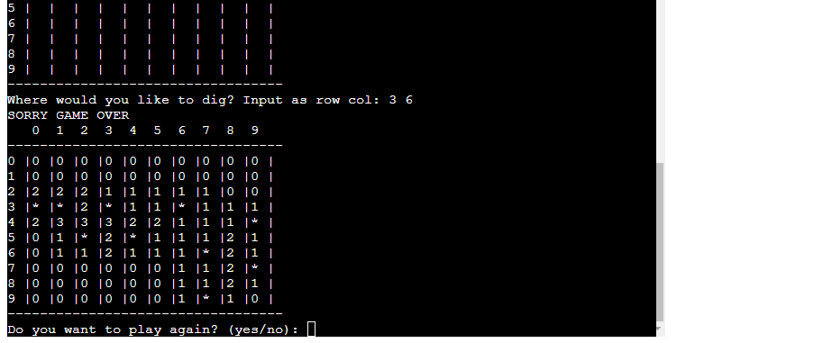
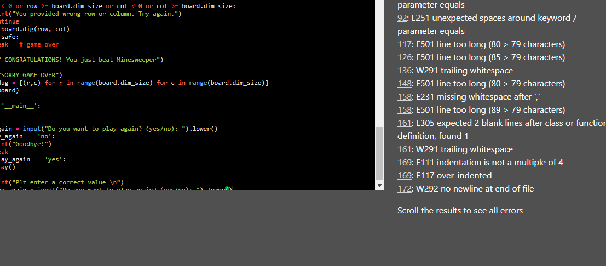
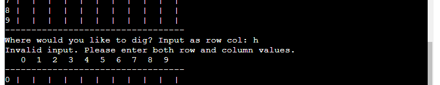

# Minesweeper Game

** Minesweeper Terminal Game written in Python.**

The objective of the game is to clear board containing hidden mines without dentonating any of them, with help from clues about the number of neighboring mines in each field.
Click here to play the game [Link to live site](https://mine-sweeper1-d9da0b71fbea.herokuapp.com/)

## User Experience
### Site purpose
To provide a simple fun game for the people who want to challenge themself and like logic game.

###

### User Goals
As a user I want :
* First of all to have a simple fun game and be challenged. (The user get's challenged with different level of difficulty and in every dig the user must avoid the mines which are hidden and put randomly.)
* Secondly, to learn to play and understand the game. (The user get's to understand the game when the user read the instructions.)
* To play the game without any issues. (If an invalid input occurs the player get's to know what is wrong with an error message.)
* To know if I won the game or lose. (The user get's feeadback message if the user won or the user lose when the game is over. )

### Projects Goals
As programmer of the game, I want the user to meet their goals(above). And i also want the game to run wihout bugs.

## Flowchart
I used a Flowchart to plan out how the code should work

## Features
### Existing Features
* Start of the game
 * Welcomes to the player.
 * Give the instructions of the game to user
 * Show the game board .
 * Ask the user where would you like to dig row,col.

* The player wins/Loses
 * The players get's asked if he want play again.
 * If the user want to play again.
 * If the user want to play again it takes them to the beginning of the game
 * If the user dont want to play again 

### Future Features
 * Add score to the game
 * Add limit time to game 

## Testing
### Manual testing 
I tested the code many times in the local terminal and in the mock terminal on the deployed site Heroku.
I tried to put invalid input and check that all error types are accounted for ( outside size of board, string are not excepted).

### Automated testing
I used my school Code Institutes own validator to check the code automated.No significant errors were found, most of the errors were fixed and the remaining were kept as per mentor's instruction.

## Technologies Used
* languages :
    * Python.
* Libaraies:
    * Random
    * Re
* Others:
    * Github
        - To store the repository for submission.
    * Gitpod
        - To create the project.
    * Heroku
        - To deploy a live version of the terminal.
    * Lucid
        - To make a flowchart for preparation the project
    * Node.JS
        - To get the game running as it is required for app to run.
    * pep8online
        - To validate the python code to check for any error within my code.

## Bugs
### Fixed bugs
* one error that i had when the user put wrong input the message of invalid input not appear and i fixed this error as shown.
 

## Deployment
The game was deployed through Heroku. The steps are as following:

1. Log into Github and locate.
2. After creating Heroku account, Click "New" to create new app from the dashboard.
3. Create a unique name for the game and select your region
4. Go to setting and add the necessary config_vars and buildpacks are set to Python and NodeJS.
5. Click Deploy.
6. Scroll Down to Deployment Method and select GitHub.
7. Select the name from Github to be deployed.
8. Scroll down to the deploy options:
Click Automatic deploys.This was chosen for this project.

## Creadits
### Code 
 - For general information [W3 Schools](https://www.w3schools.com/), [Open Source](https://opensource.com/), [GeeksforGeeks](https://www.geeksforgeeks.org/)
   and [Ioflood](https://ioflood.com/blog/python-2d-array/)
 - I used this vedio on YouTube as main guide and followed it step by step [YouTube](https://youtu.be/8ext9G7xspg?si=j8v5UO6GdQ8CFFkV)
 - I aslo use this GitHub project as main guide [Github Project](https://github.com/didzis1/Minesweeper_project/tree/main)

### Acknowledgements
Thanks to my mentor [Precious Ljege](https://github.com/precious-ijege) for advising me.
Thanks to my family for trying out the game.
